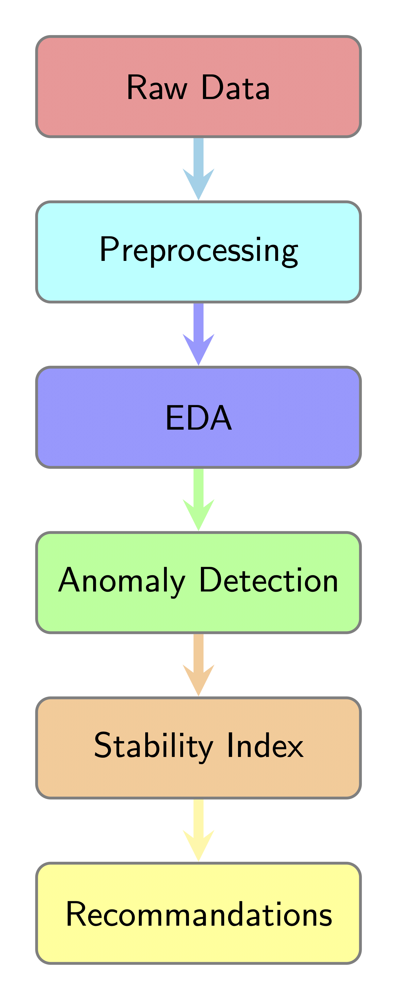

# UBS Challenge: Technical Report

## Introduction
Welcome to our project repository for the UBS Challenge. This project focuses on leveraging Instagram data to identify and capitalize on investment opportunities. This documentation provides a comprehensive overview of our analytical process, detailing our methodologies, the challenges we encountered, and the strategies we adopted to overcome these issues.

We construct the following pipeline for the task:

    

### Repository Structure
This repository is structured into several directories corresponding to the major phases of our project:
- `preprocessing`: Scripts for data cleaning and integration.
- `EDA`: Exploratory data analysis notebooks.
- `anomaly_detection`: Notebooks focused on identifying anomalies.
- `stability_index`: A notebook focused on identifying companies with little day-to-day fluctuation.
- `resources`: Competition documents.

## Preprocessing
The preprocessing phase is critical as it prepares the raw data for analysis. This stage includes cleaning the data, integrating financial data from Yahoo, and creating additional features needed for anomaly detection. The additional features, were chosen in a way that they were comparable between different company sizes (Even though, we also scaled the data). The idea of this variables is to add information about previous observations, to capture the "time component".

- Content Variable = pictures + videos: We assume that the effect of a video or of a picture will be the similar.
- Likes per Content = Likes/Content: To get an estimator of the amount of likes per content.
- Comments per Likes: We dont think comments by themselves are relevant for the analysis, as they could be either possitive or negatives. However, if we calculate the ratio between comments and likes we could get an estimation of its sentiment.
- The weekly change of the followers, Likes per content, conments per Likes and the closing stock price.
- Moving Averages to extract information about the trend and be able to identify better the anomalies.

### Notebooks and Scripts
- `exploration_and_cleansing.ipynb`: Walks through initial data cleaning steps, addressing missing values and deleting features not taken into account.
- `financial_data_integration.ipynb`: Integrates financial data of public companies, subsetting the original raw data.
- `feature_engineering.ipynb`: Develops new features that are crucial for effective anomaly detection.

## Exploratory Data Analysis (EDA)
After preprocessing, we conduct a thorough exploratory analysis to understand the nuances of the data better.

### Notebooks
- `general_analysis.ipynb`: Provides a broad analysis of the dataset, highlighting key statistics and distributions.
- `derived_feature_distribution_boxplots.ipynb`: Visualizes the distribution of newly created features to identify any skewness or anomalies.
- `time_series_examples.ipynb`: Examines time-series data to showcase what the data that will be used in the anomaly detection look like.

## Anomaly Detection
The anomaly detection component utilizes statistical and machine learning methods to identify unusual patterns that could signify investment opportunities. Further explanation will be provided in the Modelling Approach Summary.

### Notebook
- `model.ipynb`: Provides the anomaly detection models and the "Sell Strategy".

## Stability Index

### Notebook

- `stability_index.ipynb`: The notebook included in the directory using the discrepancy between short-term movements and long-term movements, in order to estimate the stability of each company within a single numerical value.
- It also includes visualization of three representative companies, which show that the estimated stability correlates to the actual market and sentiment stability.
**Long Term Investment Recommendations**

As stock markets historically tend to go up, the sell signal already provides a great investment opportunity.
In order to leverage this, we are looking for stable companies with big market caps, that achieve long term growth with as little risk as possible.

Thus, the stability index estimation model aims to provide the most stable companies. According to statistical analysis on the given data, this indeed does hold.

## Modelling Approach Summary
 ### Model Selection
   - For the anomaly analysis, two models were chosen:
      - Autoencoder Neural Network: It was selected for its proficiency in learning normal data patterns and identifying outliers based on reconstruction errors.
     - Isolation Forest (Iso Trees): Complementing the Autoencoder, the Isolation Forest was used for its effectiveness in anomaly isolation. 
     - Justification: Both models align with the project's objective of detecting anomalies without prior knowledge of their characteristics. The Autoencoder is justified for its feature learning capabilities, while the Isolation Forest offers a quick and effective method to pinpoint potential anomalies, even in the presence of noise. After analyzing both outputs, the Isolation Trees output was found more robust due to the training computation (for more details see notebook "models"). 
   - For the stability index, a statistical model was used that calculated the weighted sum of the standard deviation of:
     - The engagement consistency score (rolling likes per content and rolling comments per like).
     - The growth consistency score (normalized rolling relative change of weekly followers).
     - The price volatility score (normalized rolling relative change of market closing prices).
     - The moving average convergence score (normalized rolling comments per likes and follower change).

### Techniques for model interpretation (See notebook: models.ipnyb)

**"find_outliers"** function: Aims to identify features in the dataset that have values deviating significantly from the expected range, based on statistical norms. Such features are flagged as potential variables that made the model identify the observation as an anomaly. 

Assumptions: 

- Normal Distribution: The function assumes that the data for each feature follows a normal distribution.

- Independence of Features: The function treats each feature independently when determining outliers. It does not account for potential correlations between features that might explain the observed values.

**"Relevant Features"** code: The goal, as well as in "find outliers" is to identify the features that contributed the most to the model in order to clasify an observation as anomaly, specifically for the autoencoder output. By focusing which features have significantly high reconstruction errors, this analysis enhances the interpretability of the anomalies detected. 

Findings:

Both analysis gave us different results:

"Relevant Features" showed that, likes_per_content_weekly_change and comments_per_likes_weekly_change were the most relevant ones, while in "find_outliers" identified comments_per_likes and its moving averages as the most relevant ones. 

Due to the problems of convergence of the neural network and from our interpretations of the results (which suggest a stronger alignment with our expected outcomes), we decided to continue working with the results of the Isolation Tree. 

### Strategic Application

**Sell Recommendation**

The analysis of the identified anomalous observations allowed us to derive actionable insights. Specifically, by examining the underlying features that contributed to the anomalies, we were able to come up with a strategic "Sell" recommendation. This strategy is grounded in the rationale that:

Significant decreases in follower count: Suggest a loss of consumer or investor confidence, which can be an early indicator of potential issues within the company that may affect stock prices.
Spikes in negative engagement metrics (likes, comments): These may imply public relations challenges or other negative events that could lead to decreased investor sentiment and subsequent stock price declines.
The method reached an accuracy of 60%.
By leveraging these insights, the "Sell" strategy is formulated to capitalize on early detection of negative trends, thus enabling timely decision-making that could protect investments from potential downturns. It's a proactive approach to mitigate risk based on the predictive signals from our anomaly detection models. 

### Recommendations for Model Enhancement

  - Temporal Analysis: For time-series data, leverage models like LSTM to account for temporal correlations and potentially improve detection accuracy.
  - Use of Advanced Anomaly Detection Techniques: Beyond traditional autoencoders and isolation trees, we can explore more advanced anomaly detection techniques. For example, Variational Autoencoders (VAEs) or Generative Adversarial Networks (GANs) for anomaly detection can provide more sophisticated mechanisms to learn the data distribution and could potentially offer better performance.

## Challenges and Solutions
- The first challenge encountered was to develop questions which we could answer given the data.
- The second challenge, directly related, was to clean the data, provided the huge amount of missing values, and its complex structure.
- The third challenge was to develop an algorithm which could actually perform better than random guessing, given the little signal in the data.

Overall, the biggest issue in providing value through our approach, is directly related to the quality of the data.
The following enhancements would make our approach more effective:
- More data.
- More informative features, like the comments themselves (for sentiment analysis), etc.
- No missing values.
- A clear understanding of the insights that the dataset is aiming to provide.

## Conclusion
This project offers a few key outcomes, which are directly applied to the given data, but can be customized to different datasets with very little effort.
- Company stability estimates in order to evaluate long term investment goals.
- Short term negative public sentiment in order to generate Sell-Signals and skip market dips.
- Key insights into the effects of different dataset features on public market cap evaluation.

## How to Use This Repository
- Download packages listed in requirements.txt.
- Start with the preprocessing folder, running subsequently the three notebooks.
- Take a look at the EDA folder for gaining a deeper understanding about the nuances of the data.
- Take a deep dive into the Anomaly Detection folder to explore the use models and their performance.
- Use the stability index to evaluate long term investment goals. Edit hyperparameters according to your estimate.

## Acknowledgments
Thanks to all contributors, data providers, and supporters who made this project possible.

## Contribuitors:
Alain Joss, Jakob Johannes Bauer, Santiago Ormando Aramburu
